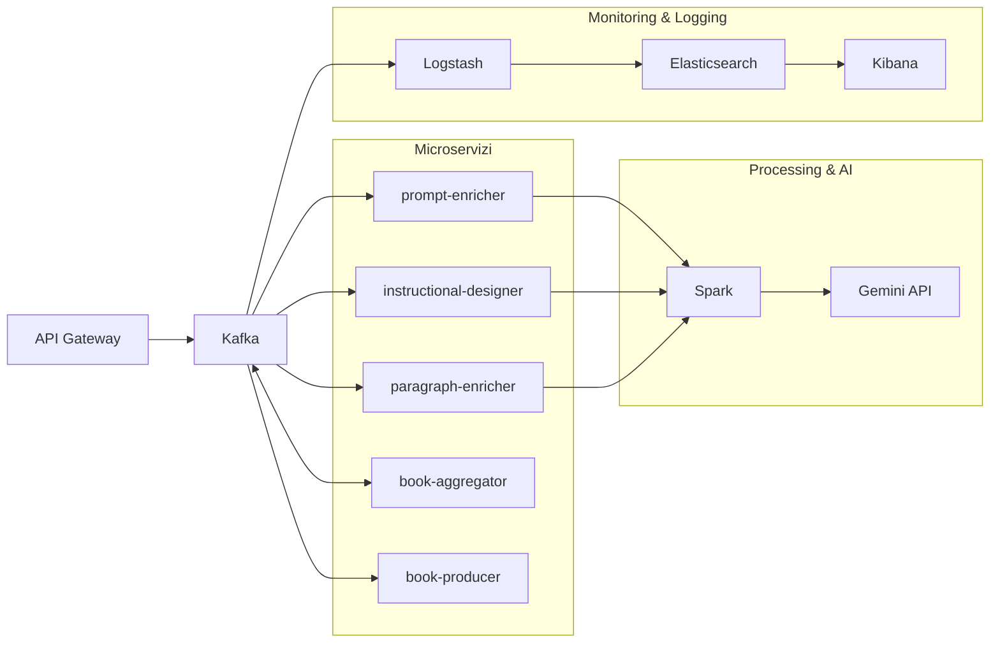

+++
menus = 'main'
linkTitle = 'Docs'
title = 'Documentazione'
weight = 1
+++

Benvenuto nella sezione di documentazione! In questa pagina esploreremo l'infrastruttura che supporta i nostri sistemi, le tecnologie utilizzate e il flusso di dati che collega i vari componenti del nostro ecosistema. Il diagramma seguente fornisce una panoramica visiva dell'architettura.

### Infrastruttura

L'infrastruttura è stata progettata per garantire scalabilità, affidabilità e sicurezza. I principali componenti includono:
- **API Gateway**: punto di ingresso per le richieste, che vengono instradate verso i microservizi.
- **Kafka**: sistema di messaggistica centrale per la comunicazione asincrona tra i componenti.
- **Microservizi**: ciascuno con responsabilità specifiche, come l'arricchimento dei dati e l'aggregazione dei contenuti.
- **Stack di Logging e Monitoring (ELK)**: per il monitoraggio e l'analisi dei log.

### Tecnologie Utilizzate
Per costruire e gestire questa infrastruttura, utilizziamo:
- **Docker e Kubernetes**: per il deployment e la gestione dei container.
- **Linguaggi di programmazione**: Python, Typescript, Javascript e Java per il backend, Flutter ed HUGO per il frontend.
- **Sistemi di logging**: Logstash, Elasticsearch e Kibana per il monitoraggio.

### Flusso di Dati
Il flusso di dati è orchestrato attraverso Kafka, che funge da hub centrale. I microservizi consumano e producono messaggi, garantendo un'elaborazione modulare e asincrona. I dati vengono inoltre inviati allo stack ELK per il monitoraggio.

Questa documentazione ti guiderà attraverso ogni componente, fornendo dettagli tecnici per comprendere e utilizzare al meglio il sistema.
