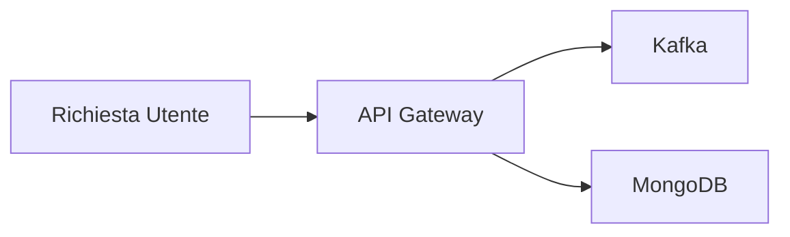

# API Gateway



## Descrizione
L'API Gateway, sviluppato con il framework NestJS, funge da punto di ingresso centrale per tutte le richieste verso i servizi backend. Consente di gestire, monitorare e ottimizzare il traffico API, migliorando la sicurezza e le prestazioni.
## Funzionalità principali

### 1. **Routing delle richieste**
- Instradamento delle richieste verso i servizi backend appropriati.
- Supporto per regole di routing basate su URL, intestazioni o parametri.

### 2. **Trasformazione delle Richieste e Risposte**
- Supporto esclusivo per il formato JSON.
- Validazione automatica dei dati in ingresso.
## Installazione
Questo progetto si trova all'interno della monorepo nella directory `apps/api-gateway`.
- Per installare le dipendenze, eseguire:
```bash
npm install
```
- Per avviare l'applicazione, eseguire:
```bash
npm run start:dev
```
