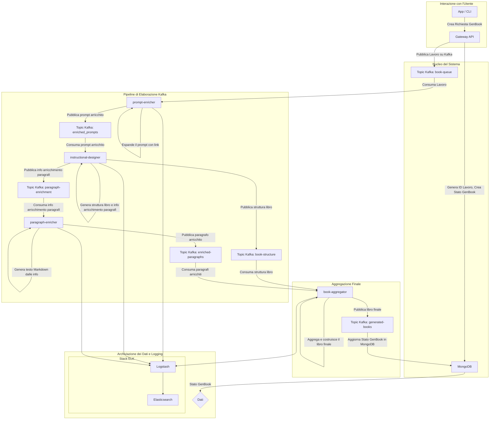

# Documentazione del Flusso di Dati di GenBook

## Panoramica

Questo documento descrive il flusso di dati del sistema GenBook, basandosi sul diagramma del flusso di dati. Il sistema è suddiviso in quattro sezioni principali:

1. **Interazione con l'Utente**: L'utente interagisce con il sistema tramite un'applicazione o CLI, avviando la creazione di una richiesta GenBook che viene gestita dal Gateway API.
2. **Nucleo del Sistema**: Il Gateway API genera un ID lavoro unico, aggiorna lo stato in MongoDB e pubblica il lavoro su un topic Kafka per l'elaborazione.
3. **Pipeline di Elaborazione Kafka**: Una serie di microservizi elabora i dati, arricchendo i prompt, generando la struttura del libro e i paragrafi arricchiti.
4. **Aggregazione Finale e Archiviazione**: I dati vengono aggregati per costruire il libro finale, pubblicati su un topic Kafka e archiviati in MongoDB. I log vengono raccolti dallo stack ELK per il monitoraggio.

Ogni componente e processo è rappresentato nel diagramma sopra.
