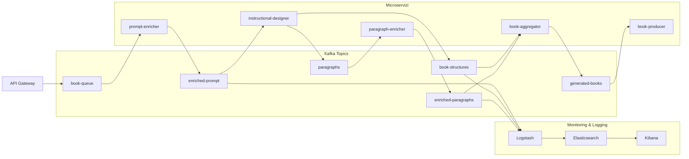

+++
sidebar.open = true
weight = 1
+++
## Infrastruttura del Progetto

### Descrizione dell'Infrastruttura

L'infrastruttura del progetto è composta da tre principali sezioni:

1. **API Gateway e Kafka Topics**:
   - L'API Gateway funge da punto di ingresso per le richieste, che vengono instradate verso il topic Kafka `book-queue`.
   - I dati attraversano una serie di topic Kafka (`enriched-prompt`, `book-structures`, `paragraphs`, `enriched-paragraphs`, `generated-books`) che fungono da buffer e punti di scambio tra i microservizi.

2. **Microservizi**:
   - I microservizi sono organizzati per gestire specifiche funzionalità:
     - `prompt-enricher`: Arricchisce i prompt ricevuti.
     - `instructional-designer`: Suddivide i dati in strutture di libro e paragrafi.
     - `paragraph-enricher`: Arricchisce i paragrafi generati.
     - `book-aggregator`: Combina le strutture e i paragrafi arricchiti.
     - `book-producer`: Produce i libri finali.

3. **Monitoring & Logging**:
   - Lo stack ELK (Logstash, Elasticsearch, Kibana) è utilizzato per il monitoraggio e la registrazione dei log.
   - I dati di log vengono inviati da vari componenti a Logstash, che li inoltra a Elasticsearch per l'archiviazione. Kibana fornisce un'interfaccia per la visualizzazione.

### Flusso dei Dati

- Le richieste iniziano dall'API Gateway e vengono elaborate attraverso una pipeline di microservizi.
- I dati vengono arricchiti, suddivisi, aggregati e infine trasformati in libri generati.
- Durante il processo, i log vengono raccolti e analizzati per garantire il monitoraggio continuo.

### Architettura Modulare

L'architettura modulare consente di:

- Scalare i singoli componenti in base alle necessità.
- Semplificare la manutenzione e l'integrazione di nuove funzionalità.
- Garantire un'elaborazione efficiente e affidabile.

Questa infrastruttura è progettata per supportare un flusso di lavoro robusto e scalabile, con un'attenzione particolare al monitoraggio e alla tracciabilità dei dati.
