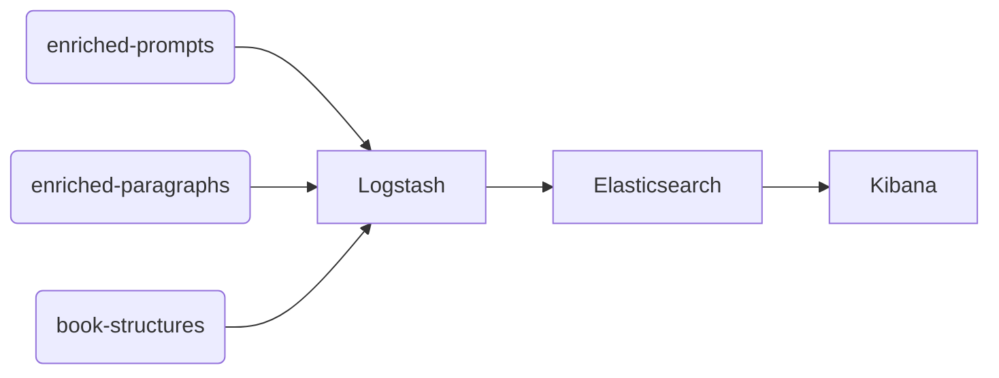

+++
title = "ELK Stack"
+++

## Flusso Dati 

### Descrizione del Flusso

Il grafico sopra rappresenta il flusso dei dati all'interno dello stack ELK (Elasticsearch, Logstash, Kibana). Ecco una descrizione dettagliata di ogni componente e del loro ruolo:

1. **Topics di Input**:
   - `enriched-prompts`: Contiene i dati relativi ai prompt arricchiti.
   - `enriched-paragraphs`: Contiene i paragrafi arricchiti.
   - `book-structures`: Contiene le strutture dei libri.

   Questi dati rappresentano i punti di ingresso nel sistema.

2. **Logstash**:
   - Logstash è il servizio responsabile dell'elaborazione e della trasformazione dei dati in ingresso. Riceve i dati dai topics di input e li prepara per l'indicizzazione.

3. **Elasticsearch**:
   - Elasticsearch è il motore di ricerca e analisi che memorizza i dati elaborati da Logstash. Consente di eseguire ricerche rapide e analisi sui dati.

4. **Kibana**:
   - Kibana è l'interfaccia utente che consente di visualizzare e analizzare i dati memorizzati in Elasticsearch. Fornisce dashboard interattivi e strumenti di visualizzazione.

### Utilizzo

Questo flusso è utile per gestire grandi quantità di dati strutturati e non strutturati, consentendo di trasformarli, indicizzarli e analizzarli in modo efficiente. Lo stack ELK è comunemente utilizzato per il monitoraggio, l'analisi dei log e la business intelligence.

### Vantaggi

- **Scalabilità**: Lo stack ELK può gestire grandi volumi di dati.
- **Flessibilità**: Supporta diversi tipi di dati e consente personalizzazioni.
- **Visualizzazione Intuitiva**: Kibana offre strumenti di visualizzazione potenti e facili da usare.

### Conclusione

Lo stack ELK è una soluzione completa per la gestione e l'analisi dei dati. Il flusso descritto nel grafico rappresenta un esempio di come i dati possono essere trasformati e analizzati per ottenere informazioni utili.