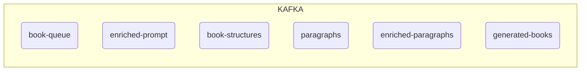
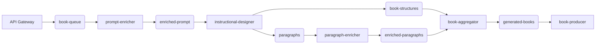

## Topic di Kafka

I topic di Kafka rappresentano i canali di comunicazione utilizzati per lo scambio di messaggi tra i vari microservizi. Ogni topic è identificato da un nome univoco e funge da buffer per i dati che vengono prodotti e consumati dai servizi. Nel diagramma sopra, i topic sono rappresentati come ovali e sono raggruppati all'interno del riquadro "KAFKA". 

Ecco una breve descrizione dei topic:
- **book-queue**: Contiene le richieste iniziali inviate dall'API Gateway.
- **enriched-prompt**: Memorizza i prompt arricchiti dal microservizio `prompt-enricher`.
- **book-structures**: Contiene le strutture dei libri generate dal microservizio `instructional-designer`.
- **paragraphs**: Raccoglie i paragrafi generati dal microservizio `instructional-designer`.
- **enriched-paragraphs**: Contiene i paragrafi arricchiti dal microservizio `paragraph-enricher`.
- **generated-books**: Memorizza i libri completi generati dal microservizio `book-aggregator`.

## Flusso lavorativo

Il flusso lavorativo illustra come i dati si muovono attraverso i vari microservizi e i topic di Kafka. Ecco una descrizione passo-passo del processo:

1. **API Gateway**: Riceve le richieste iniziali e le invia al topic `book-queue`.
2. **Prompt Enricher**: Consuma i messaggi da `book-queue`, arricchisce i prompt e li pubblica su `enriched-prompt`.
3. **Instructional Designer**: Consuma i prompt arricchiti da `enriched-prompt` e genera sia le strutture dei libri (`book-structures`) che i paragrafi (`paragraphs`).
4. **Paragraph Enricher**: Consuma i paragrafi da `paragraphs`, li arricchisce e li pubblica su `enriched-paragraphs`.
5. **Book Aggregator**: Combina le strutture dei libri (`book-structures`) e i paragrafi arricchiti (`enriched-paragraphs`) per creare libri completi, che vengono pubblicati su `generated-books`.
6. **Book Producer**: Consuma i libri completi da `generated-books` e li rende disponibili per ulteriori utilizzi o distribuzione.

Questo flusso garantisce una pipeline modulare e scalabile per la generazione e l'arricchimento dei contenuti. Ogni microservizio è responsabile di un compito specifico, facilitando la manutenzione e l'estensibilità del sistema.