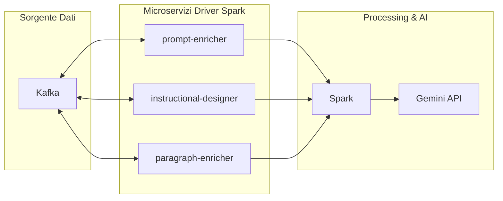

### Documentazione Spark

Questo documento descrive l'architettura e il flusso di dati che coinvolgono Spark all'interno del nostro sistema. La configurazione utilizza Kafka 4.0.0 come sorgente dati e PySpark per l'elaborazione.

#### Flusso dei Dati
1. **Sorgente Dati**: I dati vengono acquisiti da Kafka, che funge da sistema di messaggistica distribuito.
2. **Microservizi Driver Spark**: I dati vengono elaborati da tre microservizi:
   - `prompt-enricher`: Arricchisce i dati con informazioni aggiuntive.
   - `instructional-designer`: Progetta istruzioni basate sui dati.
   - `paragraph-enricher`: Migliora i paragrafi con contenuti generati.
3. **Processing & AI**: I dati elaborati dai microservizi vengono inviati a Spark per ulteriori trasformazioni e analisi. Infine, i risultati vengono inviati all'API Gemini per l'integrazione con i sistemi di intelligenza artificiale.

#### Tecnologie Utilizzate
- **Kafka 4.0.0**: Utilizzato per la gestione dei flussi di dati in tempo reale.
- **PySpark**: Libreria Python per l'elaborazione distribuita dei dati con Apache Spark.

#### Note
- Assicurarsi che i microservizi siano configurati per leggere e scrivere correttamente da e verso Kafka.
- Verificare che Spark sia configurato per ricevere input dai microservizi e inviare output all'API Gemini.

Questa architettura garantisce un'elaborazione scalabile e modulare dei dati, sfruttando le potenzialità di Kafka e Spark.