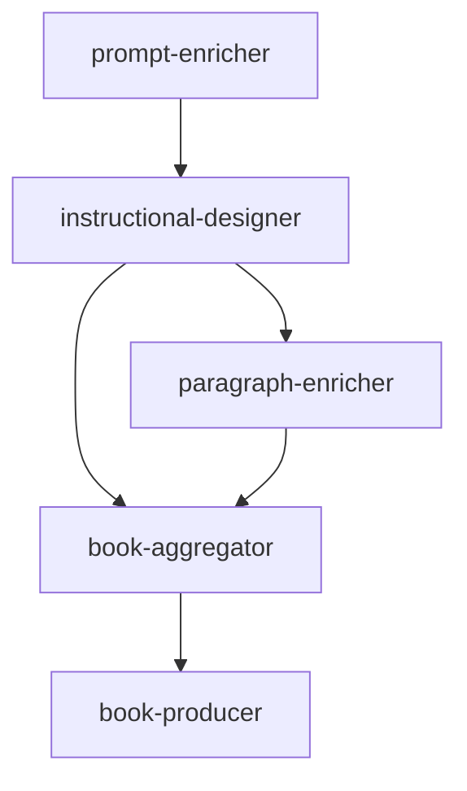

+++
sidebar.open = true
weight = 1
+++

# Overview dei Microservizi

Questa pagina fornisce una panoramica dei microservizi che compongono il sistema. Ogni microservizio è progettato per svolgere un compito specifico, contribuendo al flusso complessivo del sistema.

## Architettura dei Microservizi

Di seguito è riportato un diagramma che illustra i microservizi e le loro interconnessioni:

## Descrizione dei Microservizi
### Prompt Enricher
Questo microservizio si occupa di arricchire i prompt iniziali, preparando i dati per il flusso successivo.

### Instructional Designer
Il microservizio Instructional Designer elabora i prompt arricchiti e genera istruzioni dettagliate per i passaggi successivi.

### Paragraph Enricher
Questo microservizio arricchisce i paragrafi generati, migliorandone la qualità e la coerenza.

### Book Aggregator
Il Book Aggregator raccoglie i contenuti generati dai microservizi precedenti e li aggrega in un formato coerente.

### Book Producer
Il microservizio finale, book-producer, si occupa di produrre il risultato finale, come un libro o un documento completo.

## Flusso dei Dati

Il flusso dei dati inizia con il `prompt-enricher`, passa attraverso i vari microservizi e termina con il `book-producer`. Questo approccio modulare garantisce flessibilità e scalabilità, consentendo di aggiornare o sostituire singoli microservizi senza influire sull'intero sistema.