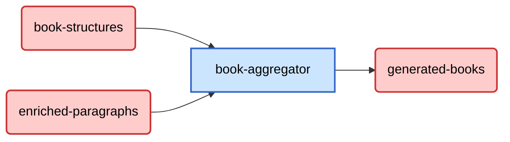

+++
weight = 4
+++

## Flusso Dati

### Descrizione del Flusso

Il diagramma sopra rappresenta il flusso dati del microservizio `book-aggregator`. Questo microservizio si occupa di aggregare e trasformare i dati provenienti da due topic di input per generare un output consolidato.

1. **Input**:
   - `book-structures`: Contiene le strutture base dei libri.
   - `enriched-paragraphs`: Contiene paragrafi arricchiti con metadati o contenuti aggiuntivi.

2. **Elaborazione**:
   - Il microservizio `book-aggregator` riceve i dati dai due topic di input e li combina per creare una rappresentazione completa e coerente del libro.

3. **Output**:
   - `generated-books`: Il risultato finale è un topic che contiene i libri generati pronti per essere utilizzati da altri sistemi o microservizi.

### Dettagli Implementativi

- **Tecnologie Utilizzate**: Il microservizio è implementato utilizzando Java e si basa su Spark Kafka Streaming.
### Scalabilità e Monitoraggio

- **Scalabilità**: Il sistema sfrutta Apache Spark per l'elaborazione distribuita e Apache Kafka per la gestione dei topic, garantendo la capacità di gestire grandi volumi di dati attraverso meccanismi di partizionamento e bilanciamento del carico.
- **Monitoraggio**: Per garantire il corretto funzionamento del flusso e identificare eventuali problemi, è stato implementato un sistema di monitoraggio basato su ELK (Elasticsearch, Logstash, e Kibana).

