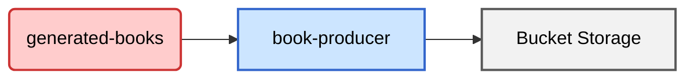

+++
weight = 5
title = "Book Producer"
description = "Descrizione del microservizio book-producer"
+++

## Flusso Dati

Il microservizio **book-producer** è responsabile della generazione di file PDF a partire dai dati ricevuti. Il flusso dei dati è rappresentato nel diagramma seguente:

### Dettagli del Flusso

1. **Input**: Il microservizio riceve i dati dal topic `generated-books`.
2. **Elaborazione**: I dati vengono processati dal microservizio `book-producer`.
3. **Output**: Il risultato dell'elaborazione è un file PDF generato.

Questo microservizio è un componente chiave per la produzione di documenti PDF automatizzati.