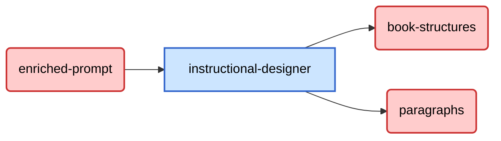

+++
weight = 2
+++

## Flusso Dati



Da Kafka riceviamo

```json
{
    "job_id": "String",
    "enriched_prompt": "String",
    // Altri campi non rilevanti per il microservizio vengono ignorati
}
```

Per poi ottenere dopo un'elaborazione un dato che inseriremo nel topic di output di Kafka per le strutture del libro.

```json
{
    "titolo_libro": "String",
    "capitoli": [
        {
            "titolo_capitolo": "String",
            "sottocapitoli": [
                "UUID",
                "UUID",
                "UUID",
                "..."
            ]
        }
    ],
    "metrics": {
        "chapter_qty": "Integer",
        "subchapter_qty": "Integer",
        "paragraphs": "Integer",
        "duration_ms": "Integer"
    }
}
```

Mentre sul topic dei paragrafi da generare

```json
{
    "paragraph_id": "String",
    "titolo_paragrafo": "String",
    "testo_segnaposto": "String",
    "enrichment_info": {
        "focus": "String",
        "tipo_arricchimento": ["String"],
        "parole_chiave": ["String"],
        "domande_guida": ["String"],
        "livello_dettaglio": "String"
    }
}
```
