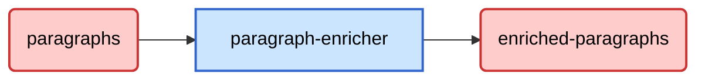

+++
weight = 3
+++

# Flusso Dati



Da Kafka riceviamo

```json
{
    "paragraph_id": "String",
    "titolo_paragrafo": "String",
    "testo_segnaposto": "String",
    "enrichment_info": {
        "focus": "String",
        "tipo_arricchimento": ["String"],
        "parole_chiave": ["String"],
        "domande_guida": ["String"],
        "livello_dettaglio": "String"
    }
}
```

Dopo l'elaborazione, otteniamo un dato che viene inserito direttamente nel topic di output di Kafka e che include anche le metriche relative al paragrafo generato.

```json
{
    "paragraph_id": "String",
    "enriched_paragraph": "String",
    "metrics": {
        "duration_ms": "Integer",
        "paragraph_length": "Integer"
    }
}
```
