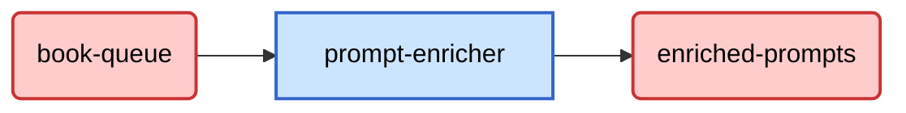

+++
weight = 1
+++


## Flusso Dati



Da Kafka riceviamo

```json
{
    "job_id": "String",
    "prompt": "String",
    "timestamp": "String"
}
```
Per poi ottenere dopo un'elaborazione un dato che inseriremo nel topic di output di Kafka.

```json
{
    "job_id": "String",
    "enriched_prompt": "String",
    "duration_ms": "Integer",
    "metrics": {
        "original_prompt_length": "Integer",
        "enriched_prompt_length": "Integer",
        "links_processed": "Integer",
        "links_failed": "Integer"
    },
    "error": "String"
}
```

Il topic `enriched-prompts` conterrà quindi tutti i dati elaborati dal microservizio.
